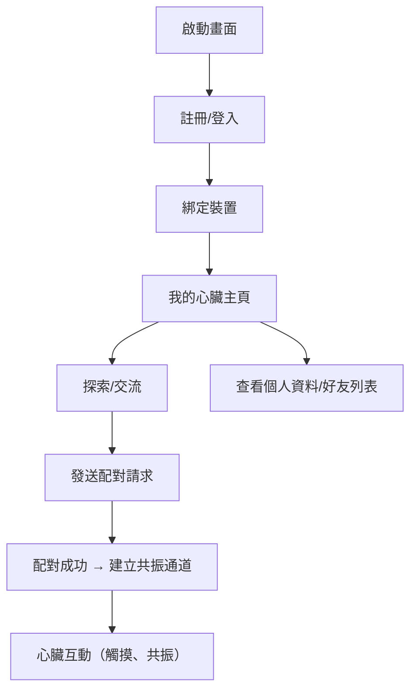

# 🎯 壓感互動裝置 - 軟體架構與開發文件

## 📦 技術架構

- 前端：Flutter（Figma 為 UI 設計參考）
- 後端：FastAPI (Python 3.11+)
- 資料庫：MySQL 8.0（使用 MySQL Workbench 管理）
- 即時通訊：WebSocket（FastAPI + `websockets` 模組）
- 實體連接：ESP32（與 WebSocket 通訊）
- 開發工具：VS Code + GitHub Copilot

---

## 📊 系統架構圖（Architecture Diagram）


> 📌 圖中內容：
> - Flutter App（登入、註冊、互動、配對）
> - FastAPI Server（REST API、WebSocket、JWT）
> - MySQL 資料表（users, devices, interactions, heartbeat_logs）
> - ESP32 裝置（壓力感測、LED、加熱模組）
> - 通訊協定：HTTP、WebSocket

---

## 🧭 系統流程圖



---

## 🧩 系統功能模組

### 1. 使用者管理
- 註冊/登入（JWT 認證）
- 使用者資料更新

### 2. 裝置管理
- 綁定 ESP32 裝置（裝置 ID）
- 查詢目前狀態與連線情形

### 3. 心臟互動邏輯
- 傳送/接收壓力節奏
- 心跳與呼吸模擬（光 + 熱）

### 4. 配對機制
- 隨機配對 / 狀態配對
- 雙向 WebSocket 通道

### 5. 視覺互動 + UI
- 漸層背景與脈動動畫
- 心臟狀態呈現（脈動/靜止）

### 6. 好友與狀態查詢（選配）
- 好友的心臟狀態共振顯示

---

## 🗄️ 資料庫設計（MySQL）

```sql
CREATE TABLE users (
    id INT PRIMARY KEY AUTO_INCREMENT,
    email VARCHAR(255) UNIQUE NOT NULL,
    password_hash VARCHAR(255) NOT NULL,
    created_at TIMESTAMP DEFAULT CURRENT_TIMESTAMP
);

CREATE TABLE devices (
    id INT PRIMARY KEY AUTO_INCREMENT,
    device_uid VARCHAR(64) UNIQUE NOT NULL,
    user_id INT,
    FOREIGN KEY (user_id) REFERENCES users(id)
);

CREATE TABLE interactions (
    id INT PRIMARY KEY AUTO_INCREMENT,
    user_id INT,
    timestamp DATETIME DEFAULT CURRENT_TIMESTAMP,
    pressure_level FLOAT,
    FOREIGN KEY (user_id) REFERENCES users(id)
);

CREATE TABLE heartbeat_logs (
    id INT PRIMARY KEY AUTO_INCREMENT,
    device_id INT,
    bpm INT,
    temperature FLOAT,
    logged_at TIMESTAMP DEFAULT CURRENT_TIMESTAMP
);
```

---

## 🧰 系統需求與相依工具

### 前端（Flutter）
- `http`: REST API 串接
- `web_socket_channel`: 雙向傳輸
- `flutter_animate`: 動畫效果
- `provider` 或 `riverpod`: 狀態管理

### 後端（FastAPI）
- `fastapi`, `uvicorn`
- `sqlalchemy`, `pydantic`
- `bcrypt`, `python-jose`
- `websockets`, `mysql-connector-python`

### ESP32（硬體）
- WiFi 模組 + WebSocket 通訊
- 壓力感測 + 溫度控制（GPIO）
- 支援 JSON 資料傳輸格式

---
